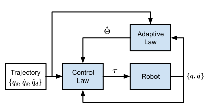
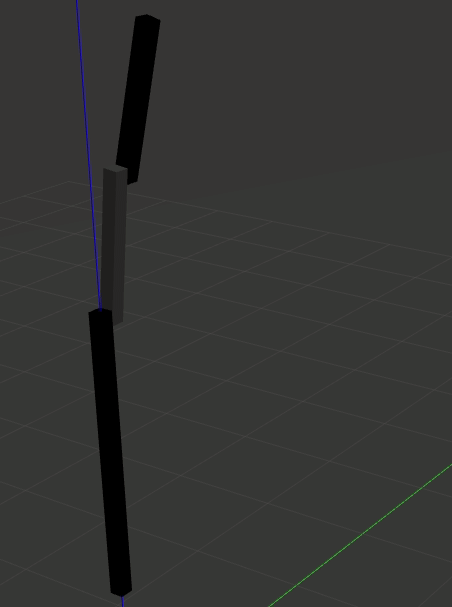

# Adaptive Control of 2DOF Planar Robots

The repository comprises two ROS packages and a folder containing matlab scripts used for processing and visualising data. The ROS packages are:
- *adaptive_controller*: Used to simulate a torque controlled 2DOF Planar robot in Gazebo with a gradient descent adaptive controller.
- *novel_adaptive_controller_paper*: Used to simulate a torque controlled 2DOF humanoid robot arm in Gazebo with a novel adaptive controller from [this](https://www.sciencedirect.com/science/article/abs/pii/S0921889013001887) paper.

Both packages use an indirect adaptive control strategy and is conceptually shown in the image below. Indirect adaptive control is simply a technique used for estimating model parameters (for example, link mass) while controlling the robot.

    

The four main components of the indirect adaptive control strategy are:

- Trajectory: This is the reference the robot must follow. The trajectory defines the position, velocity and acceleration for each joint on the robot.
- Adaptive Law: Block represents the equations used to estimate the parameters $\hat{\Theta}$ of the robot.
- Control Law: This comprise the equations used to generate torque inputs $\tau$ for joint actuation.
- Robot: Block represents the real or simulated robot.

# Running the simulations

Use "planar_RR_robot_sim.launch" to run the simulation from *adaptive_controller*:

`roslaunch adaptive_controller planar_RR_robot_sim.launch`

Use "BERT2_sim.launch" to run the simulation from *novel_adaptive_controller_paper*:

`roslaunch novel_adaptive_controller_paper BERT2_sim.launch`

The controller parameters for the simulation can be adjusted using the yaml file from the config folder for the respective ROS package. The GIF shows the simulation from the *adaptive_controller* ROS package.

    

# Miscellaneous

Software Version:
- ROS: melodic
- Gazebo: 9.0.0

Useful Resources:
- [How to create your own controller (~1hr Video)](https://www.youtube.com/watch?v=7BLc18lOFJw)
- [franka_ros custom controller examples](https://github.com/frankaemika/franka_ros/tree/develop/franka_example_controllers/src)
